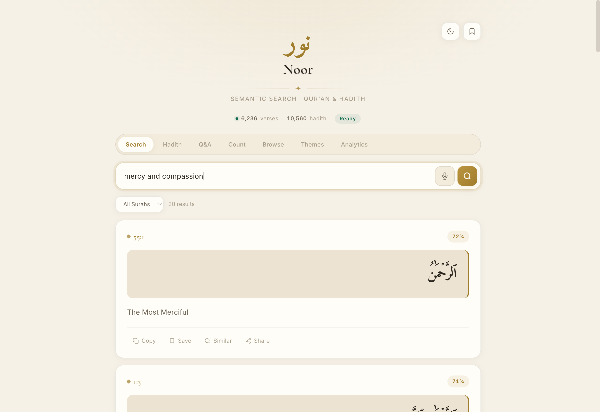
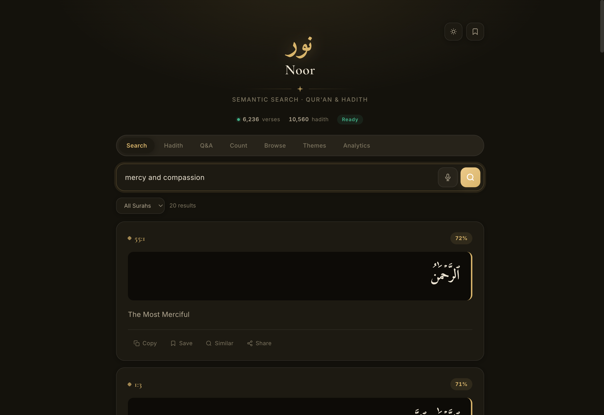
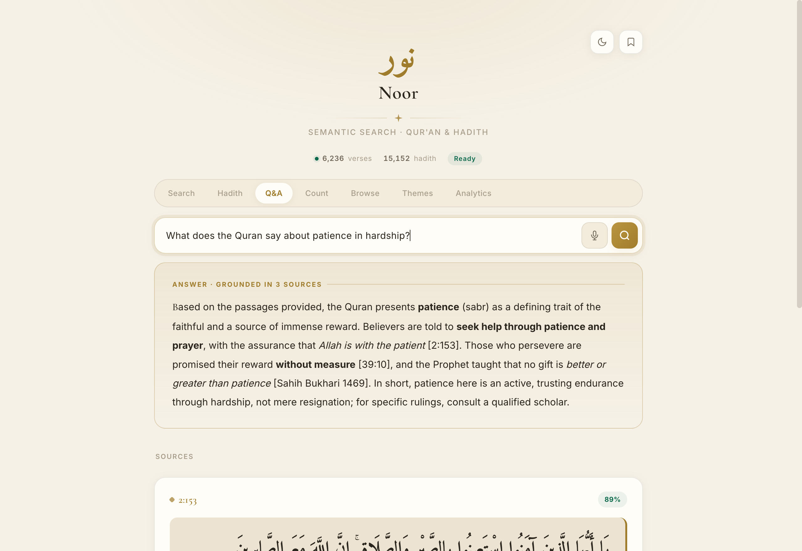

# Noor

AI-powered semantic search over the Quran and Hadith corpora. Multilingual (Arabic + English) embeddings with sub-second response on a single-node deployment.

نُور - *"light"* in Arabic.

**Try it: [app.noor.pyxis3.ai](https://app.noor.pyxis3.ai)** - type a question in Arabic or English ("verses about patience in adversity", "حديث عن حقوق الجار") and get matches by meaning, not keyword. ([noor.pyxis3.ai](https://noor.pyxis3.ai) is the project landing.)

<p align="center">
  
  
</p>

**Grounded Q&A** - a real answer synthesised from the retrieved verses and hadith, every claim cited inline:

<p align="center"></p>

## What it does

- **Semantic search** in either Arabic or English; returns top matches across the Quran + Sahih Bukhari & Sahih Muslim
- **Reference lookup** (e.g. `2:255`) resolves directly to the verse
- **Grounded Q&A (RAG)** - retrieves the most relevant verses and hadith, then an LLM writes a cited answer from *only* those passages
- **Voice search** - speak a question; it's transcribed and run through whichever mode you're in
- **Vector store** backed by `sqlite-vec` - embeddings live in a single SQLite file, no separate DB to operate
- **TF-IDF + KMeans clustering** for topic discovery and concept maps
- **Word-cloud generation** over the corpus
- **Light & dark**, Arabic-first single-file Vue 3 frontend · FastAPI backend · nginx edge

## Stack

| Layer | Choice | Why |
|---|---|---|
| Embeddings | `intfloat/multilingual-e5-small` (384-dim) | Strong multilingual baseline; small enough to run on CPU |
| Vector store | `sqlite-vec` | Zero-ops, file-backed, deployable on any host |
| API | FastAPI + Pydantic v2 | Async + automatic schema |
| Frontend | Vue 3 via CDN (no build step) | One HTML file, fastest possible iteration |
| Edge | nginx | Static + reverse proxy to `/api/` |

## Run locally

```sh
pip install -r requirements.txt
export NOOR_DATA_DIR=./data   # holds quran-dataset.csv; models and vectors.db are created here
python main.py
# API on http://localhost:8000
# Frontend served via nginx at http://localhost:3000 (see nginx.conf)
```

`NOOR_DATA_DIR` defaults to `/config`. The Quran CSV must be present there; Hadith collections are fetched from a CDN on first run.

## Architecture notes

The encoder loads at startup; the corpus is indexed in a background thread so the API serves immediately and reports progress via `/api/health`. `sklearn` (clustering) and `wordcloud` are imported lazily inside the analytics endpoints that use them, keeping their import cost off the main request path.

Indexing is idempotent: re-running skips already-indexed rows via a count-based resume, and changing the embedding model triggers a full rebuild. Storage paths are rooted at `NOOR_DATA_DIR`.

Q&A and voice are backed by two optional services, reached server-side so no model keys reach the browser: a Claude-compatible gateway (`AIGW_URL`, `AIGW_KEY`, `AIGW_MODEL`) for grounded answers, and a Whisper transcription service (`STT_URL`, `STT_MODEL`) for voice. If either is unset or unreachable, only its endpoint returns 502 - the rest of the app is unaffected.

## Why

Modern Quran/Hadith study tools are mostly keyword search. I wanted a tool that answers *intent* questions - *"verses about patience in adversity"*, *"hadith on neighbours' rights"* - and surfaces matches by meaning, not surface form. Multilingual embeddings make this practical; `sqlite-vec` makes it deployable on a Raspberry Pi.

## Contributing

Issues, ideas, and PRs are welcome - keep PRs focused on a single concern and follow the existing conventions.

## Support & sponsors

Noor is free, open-source, and has no tracking or ads. If it's useful to you, you can support continued development - pay what you like, once or monthly:

<p align="center">
  <a href="https://donate.stripe.com/3cI6oI7Gh1PG0eV8MJ5kk00"></a>
  &nbsp;
  <a href="https://buy.stripe.com/00wbJ2f8J51S9Pv1kh5kk01"></a>
</p>

## License

[MIT](LICENSE) © 2026 Omar A.
